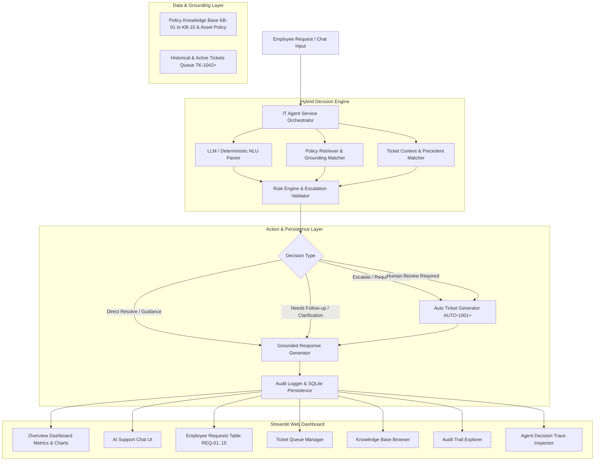

# Veridian IT Assist 🛡️
### AI-Powered Internal IT Service Resolution Agent for Veridian Corp

**Veridian IT Assist** is a submission-ready, production-grade AI agent system designed for Veridian Corp to automate internal IT support resolution. Built on a **hybrid AI architecture**, it combines natural language understanding (LLM/NLU) with a **deterministic policy rule engine**, source-grounded retrieval (`KB-01` through `KB-10` + `Asset Management Policy Extract`), automated ticket generation (`AUTO-1001`+), and full audit logging.

---

## 📌 Project Overview
Internal IT helpdesks face repetitive requests, slow triage, and unauthorized approvals. **Veridian IT Assist** enforces policy-grounded decision making, resolving simple requests directly, asking sensible diagnostic follow-ups, and escalating risky or policy-violating requests to the appropriate teams (IT Support, IT Security, Finance, Manager, or Human Review).

---

## 🎯 Mandatory Decision Rules & Grounding Matrix

| Request ID | Employee | Summary | Source Policy | Action / Escalation | Status |
|---|---|---|---|---|---|
| **REQ-01** | Aditi Sharma | Laptop dead, 3.5 yrs old | `KB-03`, `KB-ASSET-01` | IT Hardware Diagnosis; advise Finance sign-off required for early refresh (<4 yrs) | In Progress |
| **REQ-02** | Vikram Chawla | Guest Wi-Fi access | `KB-07` | Self-service at front-desk kiosk (valid 24h) | Resolved with guidance |
| **REQ-03** | Karan Mehta | Account locked out (6 attempts > 5 allowed) | `KB-01` | Escalate to IT Support for manual account unlock | Escalated to IT Support |
| **REQ-04** | Ritu Bhatia | Non-catalog data analysis tool | `KB-04` | Route to IT Security review (takes 3–5 business days) | Waiting on Security review |
| **REQ-05** | Sanjay Oberoi | VPN credentials expired | `KB-02` | Direct employee to self-renew 90-day credentials | Resolved with guidance |
| **REQ-06** | Meera Iyer | Printer paper jam | `KB-05` | Ask if queue checked & spooler restarted; request asset tag | Needs More Information |
| **REQ-07** | Farhan Ali | Remote WFH 4 days/week (wants monitor) | `KB-10`, `KB-ASSET-01` | Qualifies (>3 days); requires Manager sign-off & Finance approval before IT shipping | Pending Manager & Finance |
| **REQ-08** | Ananya Reddy | Phishing email (forwarded to team) | `KB-09` | **Critical Security Escalation** to `security@veridian-corp.example`; warn NOT to forward | Escalated to Security |
| **REQ-09** | Rohit Desai | Mailbox full | `KB-06` | Recommend archiving; manager approval required for quota increase beyond 25GB up to 50GB | Resolved with guidance |
| **REQ-10** | Kavya Pillai | Admin access to finance server | `Human Review Required` | *"The provided knowledge base does not specify this. Human review is required."* | Human Review Required |
| **REQ-11** | Nikhil Bansal | Contractor VPN access | `KB-02` | Manager approval required via access request form | Waiting for Manager Approval |
| **REQ-12** | Sneha Kulkarni | Expense tool login | `KB-08` | Clarify if account exists (IT handles login); new access routes to Finance | Needs More Information |
| **REQ-13** | Aman Gupta | Screen flickering (2 yrs old) | `KB-03`, `KB-ASSET-01` | Hardware diagnostic; replacement is NOT approved (<3 yrs) | In Progress |
| **REQ-14** | Tanya Chopra | Browser extension for productivity | `KB-04` | Route to IT Security review (3–5 days); no auto-approval | Waiting on Security review |
| **REQ-15** | Rahul Menon | "hey can you help, its not working" | `N/A` | Ask concise clarification ("Could you clarify what is not working?") | Needs Clarification |

---

## 🏗️ Architecture & Data Flow



---

## 💻 Tech Stack
- **Backend API**: FastAPI, Uvicorn, Pydantic, SQLite
- **Frontend Dashboard**: React 18, Vite, Tailwind CSS, Lucide Icons (ServiceNow / AI Observability theme)
- **Engine Logic**: Deterministic Policy Rule Engine + Intent-Aware Grounding
- **Testing & Verification**: Pytest (16 automated tests covering all 12 benchmark cases)
- **Database & Storage**: JSON seeds & SQLite (`data/veridian_it.db`)

---

## 📁 Directory Structure
```
veridian-it-assist/
├── backend/
│   ├── main.py                 # FastAPI application & SPA static router
│   ├── api_routes.py           # REST endpoints (Dashboard, Chat, Requests, Tickets, KB, Audit, Trace)
│   └── schemas.py              # Pydantic request/response data models
├── frontend/                   # React Single-Page Application (Vite + Tailwind)
│   ├── src/
│   │   ├── components/         # Sidebar, Header, MetricCard, StatusBadge, Modal
│   │   ├── pages/              # Dashboard, Chat, Requests, Tickets, KnowledgeBase, AuditTrail, DecisionTrace, SystemControls
│   │   ├── App.jsx             # Shell & navigation state
│   │   └── main.jsx            # Entry point
│   ├── dist/                   # Production bundled assets served directly by FastAPI
│   ├── package.json
│   └── vite.config.js
├── src/
│   ├── agent.py                # Core Agent service orchestrator
│   ├── database.py             # SQLite persistence with bug-free ticket deduplication
│   ├── decision_engine.py      # Deterministic rule engine with standardized intents
│   ├── policy_retriever.py     # Grounded policy search engine
│   ├── ticket_context.py       # Precedent matcher with sub-intent guards
│   ├── ticket_manager.py       # ITSM ticket creator & deduplicator
│   ├── audit.py                # Audit log recorder
│   └── llm_client.py           # NLU parser with strict local fallback
├── tests/
│   ├── test_agent.py           # Agent and all 12 test case verification
│   └── test_api.py             # FastAPI REST endpoint integration tests
├── run_server.py               # One-command server runner for both API & UI
├── requirements.txt            # Python dependencies (FastAPI, Uvicorn, Pytest)
└── app.py                      # Legacy Streamlit app (preserved for reference)
```

---

## 🚀 Installation & Local Execution

### 1. Set Up Environment
```bash
pip install -r requirements.txt
```

### 2. Run All Automated Tests
```bash
python -m pytest tests/ -v
```
*(All 16 tests pass, validating all 12 mandatory test cases!)*

### 3. Launch Enterprise Web Platform (One Command)
```bash
python run_server.py
```
- **Enterprise Web UI**: [http://localhost:8000](http://localhost:8000)
- **Interactive OpenAPI Documentation**: [http://localhost:8000/docs](http://localhost:8000/docs)
- **Health Check**: [http://localhost:8000/api/health](http://localhost:8000/api/health)

*(Optional: For frontend live hot-reloading: `cd frontend && npm run dev` on port 3000)*

---

## 📊 Platform Features
1. **Overview Dashboard**: Executive KPI cards, Category Volume bars, Status distribution, AI observability telemetry, and recent benchmark requests.
2. **AI Support Chat**: Enterprise conversational interface with quick test preset pills, real-time message stream, rich decision cards, and expandable decision trace JSON.
3. **Employee Requests**: Searchable & filterable table of official `REQ-01` to `REQ-15` cases with single-click batch processing and slide-out inspector.
4. **Ticket Queue**: ITSM service management queue (`TK-1042` to `TK-1051` + `AUTO-1001`+), priority badges, status filters, and modal inspector.
5. **Knowledge Base Repository**: Grounded policy library for `KB-01` to `KB-10` and `KB-ASSET-01`, category filters, and color-coded approval requirement badges.
6. **Immutable Audit Trail**: Compliance logging dashboard with summary metrics, filterable table, and structured JSON record inspection.
7. **Agent Decision Trace**: Signature AI Observability inspector with interactive 5-stage pipeline stepper (NLU -> Policy Grounding -> Ticket Precedent -> Rule Engine -> Final Ticket Synchronization).
8. **System Controls**: Subsystem operational health monitors, live database statistics, and safe baseline reset.

---

## ⚙️ Assumptions & Constraints
1. **Source Restriction**: The agent relies exclusively on supplied KB policies (`KB-01` to `KB-10` + Asset Policy Extract). It never invents approval rules or permissions.
2. **Human Review Requirement**: Unspecified requests (e.g. `REQ-10` Admin Access to Finance Server) output the exact mandatory fallback: *"The provided knowledge base does not specify this. Human review is required."*
3. **Simulated External Actions**: Actions like ticket creation and escalation routing are performed internally within the system state and clearly marked as prototype actions.

---

## 🔮 Future Improvements
- Multi-lingual employee support with auto-translation.
- Real-time Slack / Microsoft Teams Webhook integration.
- Automated email notification dispatch upon ticket creation.
